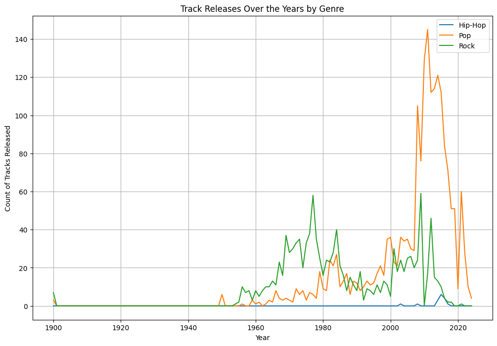
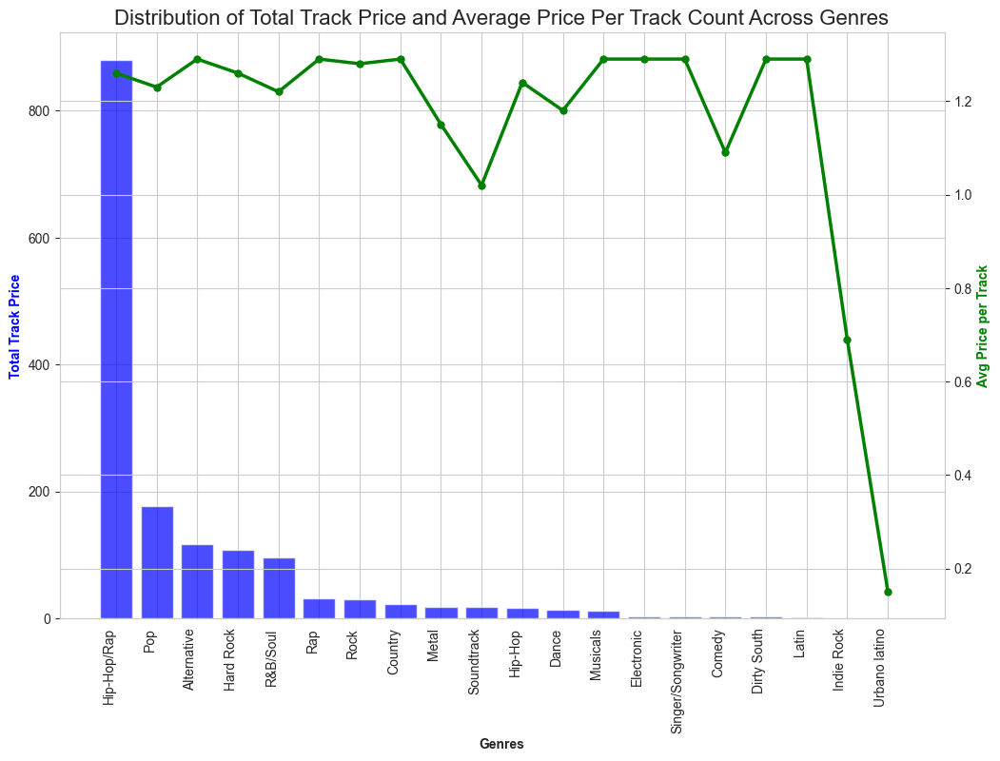
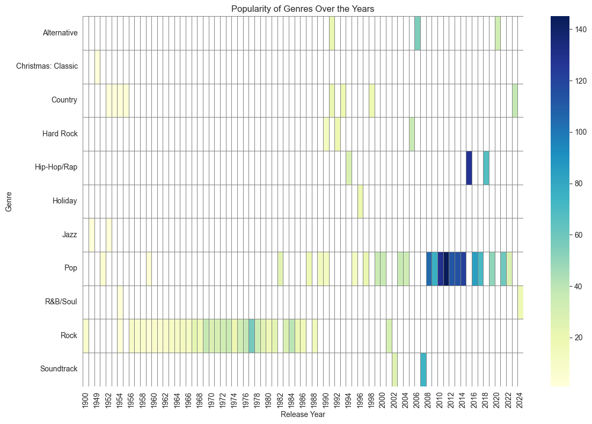
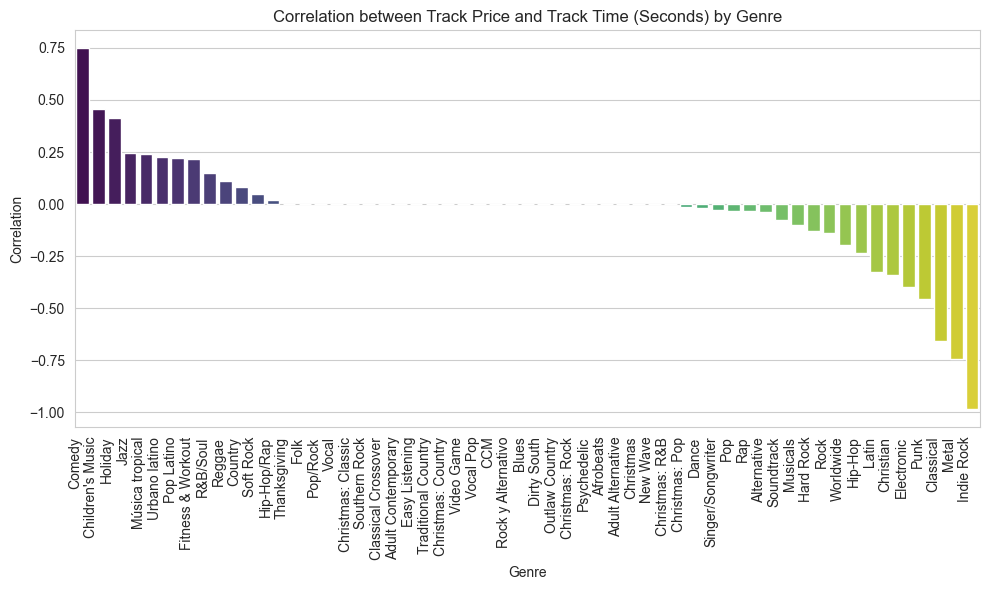
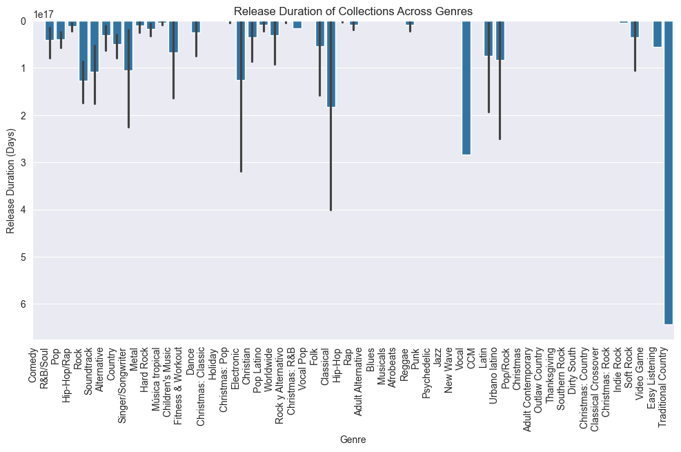
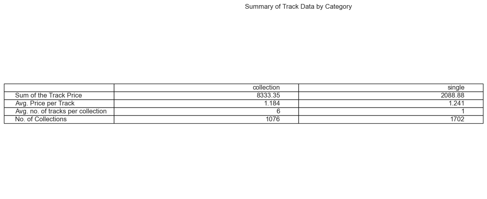
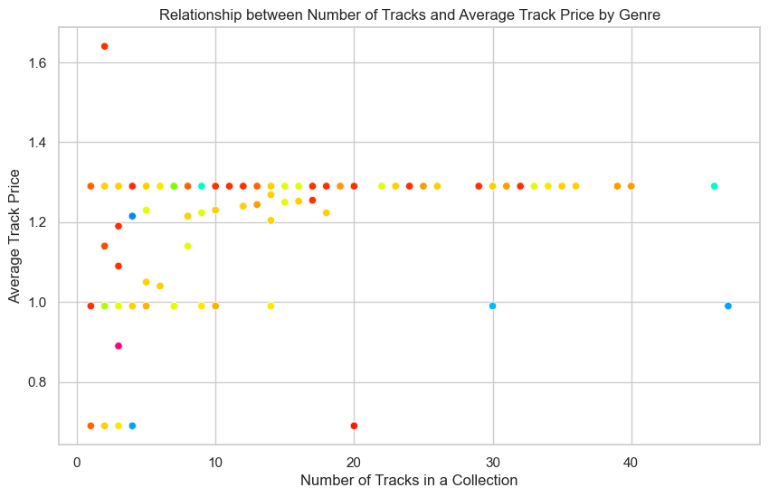
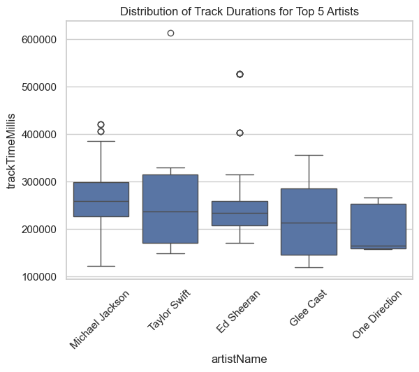

[Back to my profile](https://shefaliisharma.github.io/shefaliisharma/)


<!-- TOC -->
* [Apple Music Dataset Analysis](#apple-music-dataset-analysis)
  * [Research Objectives](#research-objectives)
  * [Methodology](#methodology)
  * [Research](#research)
  * [Conclusion](#conclusion)
<!-- TOC -->


This repository contains the analysis of a [Kaggle dataset on Apple Music](https://www.kaggle.com/datasets/kanchana1990/apple-music-dataset-10000-tracks-uncovered). The dataset provides information about tracks, collections, artists, genres, and other attributes related to Apple Music.

While the dataset is available as a csv, in a real-life scenario, the data would be stored in a database, for example, PostgreSQL database. Therefore, I have performed the analysis using SQL queries to extract relevant information and answer the related research questions. Thus the solutions provided here will scale well to larger datasets and can be easily integrated into a production environment.

The SQL table preview corresponding to the dataset is as follows:

| artistId | artistName | collectionCensoredName | collectionId | collectionName | collectionPrice | contentAdvisoryRating | country | currency | discCount | discNumber | isStreamable | kind | previewUrl | primaryGenreName | releaseDate | trackCensoredName | trackCount | trackExplicitness | trackId | trackName | trackNumber | trackPrice | trackTimeMillis |
|----------|------------|------------------------|--------------|----------------|-----------------|-----------------------|---------|----------|-----------|------------|--------------|------|------------|------------------|-------------|-------------------|------------|------------------|---------|-----------|-------------|------------|----------------|
| 219350813 | The Neighbourhood | I Love You. | 635016635 | I Love You. | 9.99 |  | USA | USD | 1 | 1 | TRUE | song | [Preview](https://audio-ssl.itunes.apple.com/itunes-assets/AudioPreview112/v4/b9/1a/41/b91a4115-f91b-4bd1-dc03-38964c1328a5/mzaf_12342250626902314230.plus.aac.p.m4a) | Alternative | 2013-04-22 12:30:00+05:30 | Float | 11 | notExplicit | 635016647 | Float | 11 | 1.29 | 261200 |
| 4218340 | Israel Kamakawiwo'ole | Wonderful World | 258387384 | Wonderful World | 11.99 |  | USA | USD | 1 | 1 | TRUE | song | [Preview](https://audio-ssl.itunes.apple.com/itunes-assets/AudioPreview125/v4/cd/47/c3/cd47c324-7645-b010-4d5b-5e7db1eb6c89/mzaf_16520999357341225048.plus.aac.p.m4a) | Worldwide | 2001-09-25 17:30:00+05:30 | Wonderful World | 12 | notExplicit | 258387389 | Wonderful World | 1 | 0.99 | 270667 |
| 396754057 | One Direction | Midnight Memories (Deluxe Edition) | 695318295 | Midnight Memories (Deluxe Edition) | 14.99 |  | USA | USD | 2 | 1 | TRUE | song | [Preview](https://audio-ssl.itunes.apple.com/itunes-assets/AudioPreview115/v4/f8/a5/e5/f8a5e57a-b74f-b93e-3252-85a195a7dbc2/mzaf_1283055366578986529.plus.aac.p.m4a) | Pop | 2013-11-25 13:30:00+05:30 | Midnight Memories | 18 | notExplicit | 695318304 | Midnight Memories | 4 | 1.29 | 176320 |
| 28721078 | Sia | 1000 Forms of Fear | 882945378 | 1000 Forms of Fear | 9.99 |  | USA | USD | 1 | 1 | TRUE | song | [Preview](https://audio-ssl.itunes.apple.com/itunes-assets/AudioPreview126/v4/76/5b/17/765b173e-f861-a846-1627-03fce14795a4/mzaf_6635366094375706754.plus.aac.p.m4a) | Pop | 2014-07-04 12:30:00+05:30 | Cellophane | 12 | notExplicit | 882945396 | Cellophane | 11 | 1.29 | 265587 |
| 80456331 | Panic! At the Disco | Pretty. Odd. (Deluxe Version) | 275965231 | Pretty. Odd. (Deluxe Version) | 12.99 |  | USA | USD | 1 | 1 | TRUE | song | [Preview](https://audio-ssl.itunes.apple.com/itunes-assets/AudioPreview115/v4/dc/79/62/dc7962c0-452b-9062-d656-0f93b70e4d65/mzaf_13536033148520859834.plus.aac.p.m4a) | Alternative | 2008-03-25 12:30:00+05:30 | Northern Downpour | 18 | notExplicit | 275965263 | Northern Downpour | 7 | 1.29 | 247773 |


DDL of the table: 

```sql
CREATE TABLE apple_music_dataset (
    "artistId" integer,
    "artistName" text,
    "collectionCensoredName" text,
    "collectionId" integer,
    "collectionName" text,
    "collectionPrice" numeric,
    "contentAdvisoryRating" character varying,
    country text,
    currency text,
    "discCount" integer,
    "discNumber" integer,
    "isStreamable" character varying,
    kind text,
    "previewUrl" text,
    "primaryGenreName" character varying,
    "releaseDate" timestamp with time zone,
    "trackCensoredName" text,
    "trackCount" integer,
    "trackExplicitness" character varying,
    "trackId" integer,
    "trackName" text,
    "trackNumber" integer,
    "trackPrice" numeric,
    "trackTimeMillis" integer
);
```

## Research Objectives

1. [How have music genres evolved over time in terms of the number of tracks released?](#temporal-trends-in-music-genres)
2. [How does the average price of explicit tracks compare across different music genres?]((#distribution-of-track-prices--average-price-within-each-genre-explicit-only)) 
3. [Can we observe any historical shifts in consumer preferences based on the number of tracks released?](#popularity-of-genre-measured-by-the-number-of-tracks-released-vary-across-different-release-years) 
4. [Is there a relationship between the price of a track and its duration within each music genre?](#correlation-between-the-track-price-and-the-track-duration-within-each-genre) 
5. [Are there genres where the length of tracks in collections tends to be longer or shorter?](#temporal-patterns-in-the-release-duration-of-tracks-within-collections) 
6. [How do the prices of individual tracks compare to those within collections?](#distribution-of-track-prices-between-single-tracks--tracks-within-collections) 
7. [How does the number of tracks in a collection relate to the average track price within each genre?](#relationship-between-no-of-tracks-in-a-collection-and-the-average-track-price-within-genres) 
8. [Which tracks stand out as outliers in duration among the top 5 artists' tracks?](#identifying-outliers-for-track-duration-for-the-top-5-artists)

## Methodology

The analysis was performed using SQL queries on the Apple Music dataset. The dataset was queried to extract relevant information and answer the research questions. The queries used in the analysis are provided in the results section below.

The data from SQL cursors was loaded into a Pandas DataFrame for further visualization and the charts were created using libraries such as Matplotlib and Seaborn.

My local setup for achieving the above consisted of: 

- PostgreSQL server running on localhost on my Mac OS Sonoma
- Postico PostgreSQL client for querying the database and exploratory data analysis
- JetBrains PyCharm IDE for writing and running Python code

## Research

The results of the analysis are summarized below. I have included the SQL queries that were used to generate the results and the final visualizations. Incase you are interested in the python code that was used to create the charts and visualizations, it is available in the github repository.

### Temporal trends in music genres

```sql
WITH genre_table AS (
    SELECT "primaryGenreName", DATE_TRUNC('year', "releaseDate")::date AS release_year, COUNT("trackId") AS track_count
    FROM apple_music_dataset
    GROUP BY "primaryGenreName", DATE_TRUNC('year', "releaseDate")
),
years AS (
    SELECT GENERATE_SERIES(MIN("releaseDate"), MAX("releaseDate"), '1 year'::interval)::date AS years
    FROM apple_music_dataset
),
all_genres AS (
    SELECT DISTINCT "primaryGenreName" AS genre FROM apple_music_dataset
),
cross_join_genre_years AS (
    SELECT years.years, all_genres.genre
    FROM years, all_genres
)
SELECT genre, years, COALESCE(genre_table.track_count, 0) AS count, AVG(COALESCE(genre_table.track_count, 0)) OVER(PARTITION BY genre)
FROM cross_join_genre_years cjgy
LEFT JOIN genre_table ON genre_table."primaryGenreName" = cjgy.genre AND genre_table.release_year = cjgy.years
```



##### Observation:
- For all the genres the pattern is the number of tracks have increased significantly around 1990's. This pattern is seen for all genres. 
- Here I have selected only three Genres for display.

### Distribution of Track Prices & Average Price within each Genre (Explicit Only)

```sql
SELECT "primaryGenreName", SUM("trackPrice") AS sum_track_price, 
COUNT("trackId") AS count_tracks_released, 
ROUND(SUM("trackPrice")/COUNT("trackId")::decimal, 2) AS price_per_track, 
RANK() OVER(ORDER BY SUM("trackPrice")/COUNT("trackId") DESC) AS rank_avg_price

FROM apple_music_dataset
WHERE "trackExplicitness" = 'explicit'
GROUP BY "primaryGenreName"
ORDER BY sum_track_price DESC;
```


##### Observation:
- Hip-Hop/Rap has the highest track price but it is rank 11th with the average price per track.

### Popularity of Genre, measured by the number of tracks released, vary across different release years

```sql
WITH ranked_genre AS(
SELECT "primaryGenreName", EXTRACT('year' FROM "releaseDate")::integer AS release_year, COUNT("trackId") AS no_tracks_released, RANK() OVER(PARTITION BY EXTRACT('year' FROM "releaseDate") ORDER BY COUNT("trackId") DESC)
FROM apple_music_dataset
GROUP BY "primaryGenreName", EXTRACT('year' FROM "releaseDate")
)

SELECT * FROM ranked_genre WHERE rank = 1 ORDER BY release_year DESC;
```



##### Observation:
With the heatmap, it can be seen that Pop has improved in popularity after late 2000s.
Here, for ease of visualization I have chosen only the most popular of the genre of the year.

### Correlation between the track price and the track duration within each genre

```sql
WITH ranked_genre AS(
SELECT "primaryGenreName", EXTRACT('year' FROM "releaseDate")::integer AS release_year, COUNT("trackId") AS no_tracks_released, RANK() OVER(PARTITION BY EXTRACT('year' FROM "releaseDate") ORDER BY COUNT("trackId") DESC)
FROM apple_music_dataset
GROUP BY "primaryGenreName", EXTRACT('year' FROM "releaseDate")
)
SELECT * FROM ranked_genre WHERE rank = 1 ORDER BY release_year DESC;
```


##### Observation:
The bar graph displays the correlation is variable across the genre with the highest being within Comedy & Indie Rock (inversely correlated).

### Temporal patterns in the release duration of tracks within Collections

```sql
WITH collection_table AS(
SELECT "collectionId","collectionName", MAX("releaseDate")::date AS last_release, MIN("releaseDate")::date AS first_release, MAX("releaseDate") - MIN("releaseDate") AS collection_release_duration
FROM apple_music_dataset
GROUP BY "collectionName", "collectionId"
ORDER BY collection_release_duration DESC),

collection_table2 AS
( 
SELECT DISTINCT "collectionId", "collectionName", "primaryGenreName"
FROM apple_music_dataset
)
SELECT "primaryGenreName", collection_table."collectionName", first_release, last_release, collection_release_duration
FROM collection_table JOIN collection_table2
ON collection_table."collectionId" = collection_table2."collectionId";
```



##### Observation:
Few durations are large in numbers. For instance, Traditional Country has ONLY one collection named: "Ultimate Waylon Jennings".
> I was curious, so I searched the collection in Apple Music ([source](https://music.apple.com/in/album/ultimate-waylon-jennings/284985709)) and found that last song: 'America' was released in 1984 & the first song: 'Highwayman'
 in 1964. 

### Distribution of Track Prices between single tracks & tracks within collections

```sql
WITH category_tracks AS 
(
SELECT "collectionId", COUNT("trackId"), CASE WHEN COUNT("trackId") = 1 THEN 'single' ELSE 'collection' END AS category_of_track 
FROM apple_music_dataset 
GROUP BY "collectionId"
)

SELECT category_of_track, SUM("trackPrice") AS sum_price, ROUND(AVG("trackPrice"),3) AS avg_track_price, COUNT("trackId")/COUNT(DISTINCT category_tracks."collectionId") AS avg_nos_of_tracks_collection, COUNT(DISTINCT category_tracks."collectionId") AS "No. of Collections"
FROM apple_music_dataset JOIN category_tracks
ON apple_music_dataset."collectionId" = category_tracks."collectionId"
GROUP BY category_of_track;
```


##### Observation:
Here is a tabular representation of basic stats of Single Tracks vs Tracks within a Collection. Obviously, single tracks are more, and the average price per track is same regardless whether the song is part of a collection or not.

### Relationship between no. of tracks in a collection and the average track price (within genres)

```sql
SELECT "primaryGenreName", "collectionName", AVG("trackPrice") OVER(PARTITION BY "collectionId") AS avg_price, COUNT("trackId") OVER(PARTITION BY "collectionId") 
FROM apple_music_dataset
WHERE "trackPrice" > 0;
```


##### Observation:
This chart shows starkly that the avg track price has been consistent regardless the no. of tracks in a collection. 

### Identifying outliers for track duration for the top 5 artists:

```sql
WITH top_artists AS (
SELECT "artistId", "artistName", RANK() OVER(ORDER BY COUNT("trackId") DESC) AS rank
FROM apple_music_dataset 
GROUP BY "artistId", "artistName"
),

outliers_table AS
(
SELECT "artistId","artistName", COUNT("trackId"),
percentile_cont(0.95) WITHIN GROUP (ORDER BY "trackTimeMillis") AS percentile_95, 
percentile_cont(0.05) WITHIN GROUP (ORDER BY "trackTimeMillis") AS percentile_5 
FROM apple_music_dataset GROUP BY "artistId", "artistName"
)

SELECT t."artistName", ad."trackName", ad."trackTimeMillis", o.percentile_95, o.percentile_5
FROM apple_music_dataset ad RIGHT JOIN outliers_table o
ON o."artistId" = ad."artistId"
JOIN top_artists t ON t."artistId" = o."artistId"
WHERE t.rank <= 5 AND (ad."trackTimeMillis" > o.percentile_95 OR ad."trackTimeMillis" < o.percentile_5);
```


##### Observation:
Durations in milli-Secs against the top 5 artists on x-axis. Do you see MJ has several outliers for the duration: and one of the is :drumroll:
>Beat it! by Michael Jackson

## Conclusion

The analysis of the Apple Music dataset provided insights into various aspects of the music industry, including temporal patterns in release dates, pricing distribution, track duration outliers, and genre-specific release patterns. These findings can be valuable for music industry professionals, researchers, and enthusiasts interested in understanding trends and patterns in the music market.